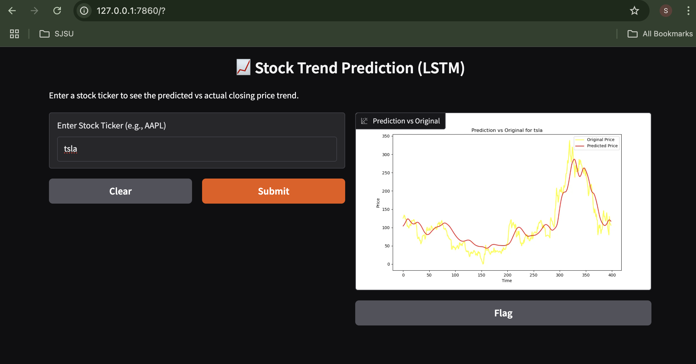

STEPS FOLLOWED : 
- pip install selenium beautifulsoup4
- Chrome version 

Chrome is up to date
Version 135.0.7049.85 (Official Build) (arm64)

- write rough draft test_extract.ipynb -> to extract and check the logics of the code

- planning to implement with OOPs concept later 

GO to folder holding the app.py file 
-  (cd .../Python-and-Data_Structure/Lab2    )
- RUN  COMMAND " streamlit run app.py"
   

GRadio 

